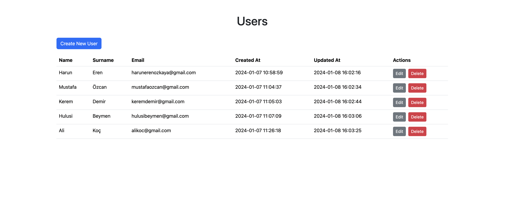
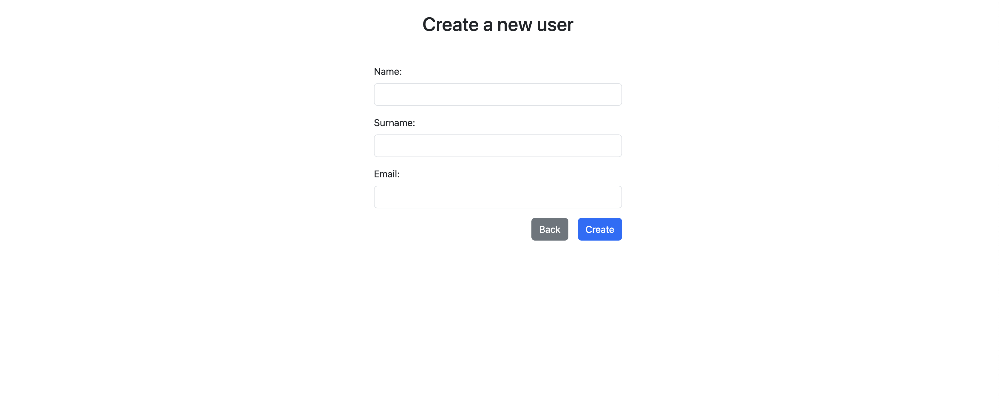
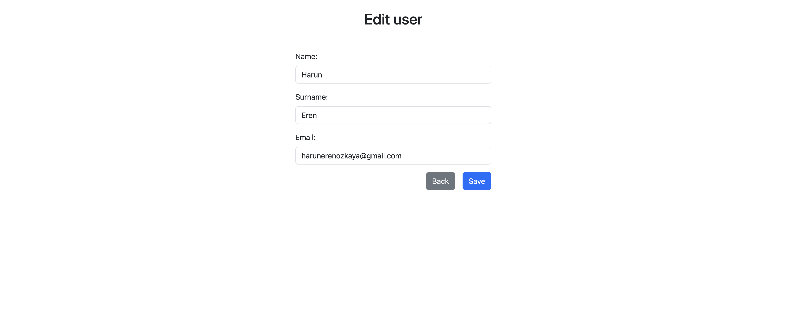

<h1 align="center"> User Management System Frontend</h1> <br> 
<p align="center">
 &nbsp;
</p>

## Table of Contents

- [Table of Contents](#table-of-contents)
- [Introduction](#introduction)
- [Navigation](#navigation)
- [Prerequisites](#prerequisites)
- [Getting Started](#getting-started)
- [Screenshots](#screenshots)
- [Technologies](#technologies)

## Introduction

The User Management System is a system that provides a mechanism for storing and managing user information. Managers can create, edit, and delete user profiles. This document describes the frontend component of the User Management System project, which offers the web interface for the manager.

## Navigation
- Backend : https://github.com/harunerenozkaya/user-management-system-backend
- Frontend : this

## Prerequisites

Before running this project, make sure you have the following installed:

- npm
- React.js
- Next.js

## Getting Started

1. Clone the repository:

    ```
    git clone https://github.com/harunerenozkaya/user-management-system-frontend
    ```

2. Install the dependencies:

    ```
    npm install
    ```

2. Build the project:

    ```
    npm run build
    ```

4. Run the application:

    ```
    npm run start 
    ```

5. Default port

- As a default , project runs on 3000 port.

## Screenshots

* Home - All users page <br><br>
   &nbsp;

* Create new user page <br><br>
   &nbsp;

* Edit user page <br><br>
   &nbsp;

## Technologies

- Typescript
- React.js
- Next.js
